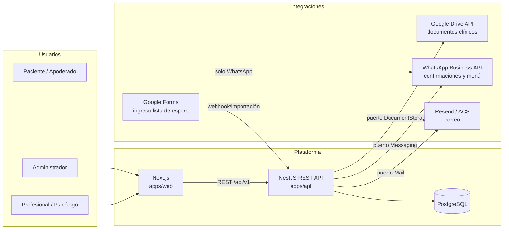
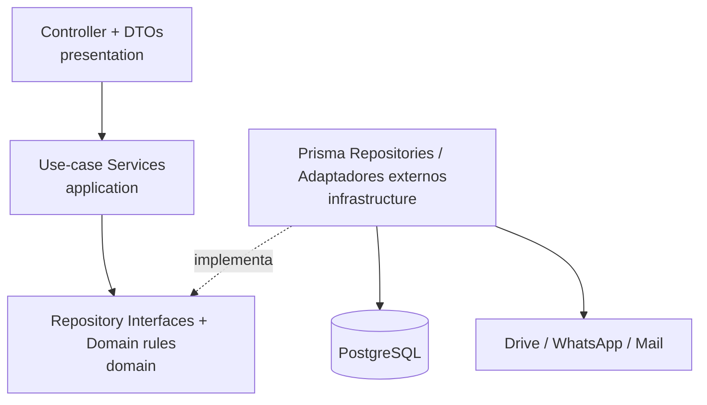

# 01 · Arquitectura del sistema

> Documento canónico. Cualquier decisión de implementación debe ser coherente con lo aquí definido.
> Complementa: [00-analisis.md](./00-analisis.md) · [02-modelo-datos.md](./02-modelo-datos.md) · [04-api-rest.md](./04-api-rest.md)

## 1. Objetivos de calidad (en orden de prioridad)

1. **Seguridad y confidencialidad clínica** — datos de menores de edad; acceso segmentado por rol y especialidad; auditoría completa e inmutable.
2. **Mantenibilidad** — el sistema evolucionará durante años y por módulos; el costo de cambiar debe mantenerse bajo.
3. **Escalabilidad organizacional** — de un centro a N centros (multi-tenant) sin reescritura.
4. **Simplicidad operacional** — un equipo pequeño debe poder operarlo; evitar infraestructura innecesaria.

## 2. Vista de contexto



Los pacientes **nunca** ingresan a la plataforma: toda su interacción ocurre por WhatsApp con **respuestas predefinidas y deterministas** (sin IA, por definición del negocio).

## 3. Estilo arquitectónico

### Monolito modular con Clean Architecture

Un único despliegue NestJS organizado en **módulos verticales** (auth, users, organizations, patients, agenda, clinical-records, documents, whatsapp, waitlist, incidents, reports), cada uno con capas internas:

```
modules/<modulo>/
├── presentation/     → controllers + DTOs (validación, Swagger). Depende de application.
├── application/      → servicios de casos de uso. Depende de domain. NO conoce Prisma ni HTTP.
├── domain/           → interfaces de repositorio, entidades/tipos de dominio, tokens DI, reglas.
└── infrastructure/   → implementaciones Prisma de repositorios, adaptadores externos.
```

**Regla de dependencia:** las flechas apuntan hacia adentro (presentation → application → domain). `infrastructure` implementa interfaces de `domain` y se inyecta vía DI. Prisma **solo** existe en `infrastructure`.

### Diagrama de capas



## 4. Decisiones de arquitectura (ADRs)

### ADR-01 · Monolito modular, no microservicios
**Contexto.** Un centro (→ decenas de centros a futuro), equipo pequeño, dominio cohesionado.
**Decisión.** Monolito modular NestJS con límites de módulo estrictos.
**Justificación.** Microservicios agregan costo operacional (red, observabilidad, consistencia) sin beneficio a esta escala. Los límites de módulo + puertos/adaptadores permiten extraer un servicio (p. ej. mensajería WhatsApp) más adelante si el volumen lo exige. Simplicidad y mantenibilidad primero.

### ADR-02 · Monorepo con npm workspaces
**Decisión.** `apps/api` (NestJS), `apps/web` (Next.js), `packages/shared` (contratos).
**Justificación.** Un solo PR toca contrato + backend + frontend de forma atómica; los tipos compartidos eliminan duplicación y drift de contratos. npm workspaces (sin Turborepo/Nx) mantiene la herramienta mínima; se puede incorporar un task-runner cuando el build lo amerite.

### ADR-03 · Multi-tenant: shared database, shared schema, columna `organization_id`
**Decisión.** Toda tabla de negocio lleva `organization_id` (FK a `organizations`) desde la primera migración. El tenant activo viaja en el JWT (`organizationId`) y **cada método de repositorio exige `organizationId` como parámetro explícito** — el aislamiento queda garantizado por diseño de la interfaz, no por convención.
**Alternativas.** DB-por-tenant (costo operacional alto para decenas de centros), schema-por-tenant (migraciones N×), RLS de PostgreSQL.
**Evolución.** Cuando existan múltiples centros reales, activar **Row-Level Security** como segunda barrera (defensa en profundidad) usando `SET app.current_org`. El diseño por columna es prerequisito de RLS, por lo que no hay retrabajo.

### ADR-04 · "Psicólogo" es una especialidad con política de confidencialidad, no un tercer rol
**Contexto.** El spec define Administrador, Profesional y Psicólogo; el psicólogo es el único que puede leer evoluciones e informes psicológicos.
**Decisión.** Roles del sistema: `ADMIN` y `PROFESSIONAL`. El psicólogo es `PROFESSIONAL` con `specialty = PSICOLOGIA`. El material clínico llevará `confidentiality = STANDARD | PSYCHOLOGICAL` (módulo 4); una **política central de acceso clínico** permitirá leer material `PSYCHOLOGICAL` únicamente a profesionales con especialidad Psicología.
**Justificación.** El permiso deriva de la especialidad, no de un rol duplicado: evita la explosión de roles (¿kinesiólogo-rol?, ¿fonoaudiólogo-rol?), soporta N psicólogos y mantiene RBAC simple. Regla de negocio explícita: **ni siquiera ADMIN lee contenido psicológico** (solo metadatos administrativos: que el documento existe, fecha y autor); es el criterio más protector y reversible.

### ADR-05 · Refresh tokens opacos, rotativos, almacenados hasheados
**Decisión.** Access token JWT firmado (HS256, 15 min) + refresh token **opaco** (64 bytes aleatorios), guardado como hash SHA-256 en `refresh_tokens`, con rotación en cada uso, cadena `replaced_by` y **detección de reuso** (si llega un token ya rotado ⇒ se revocan todas las sesiones del usuario y se audita `TOKEN_REUSE_DETECTED`).
**Justificación.** Un refresh JWT no puede revocarse individualmente; el opaco en DB da revocación por sesión, cierre de sesión remoto y evidencia forense — apropiado para datos clínicos.

### ADR-06 · Cookies httpOnly + proxy same-origin en Next
**Decisión.** La API emite `ct_access` (httpOnly, path `/`), `ct_refresh` (httpOnly, path `/api/v1/auth`) y `ct_session` (marcador httpOnly de sesión para el middleware de Next). El frontend llama a su **propio origen** `/api/*` y `next.config.ts` reescribe hacia la API ⇒ mismas cookies en dev y producción, sin CORS en el camino del navegador y sin tokens accesibles desde JavaScript (mitiga XSS). La API además acepta `Authorization: Bearer` para clientes no-navegador y Swagger.
**Justificación.** `localStorage` es vulnerable a XSS; cookies cross-origin son frágiles (SameSite). El rewrite reproduce en desarrollo la topología de producción (mismo dominio detrás de un reverse proxy en Azure).

### ADR-07 · Repository pattern con interfaces en `domain` + tokens de DI
**Decisión.** Los servicios de aplicación dependen de interfaces (`UserRepository`) inyectadas por token (`USER_REPOSITORY`). Prisma implementa esas interfaces en `infrastructure`.
**Justificación.** SOLID/DIP: casos de uso testeables con dobles en memoria (sin DB), y la persistencia es reemplazable. Es también el punto único donde se garantiza el filtro por `organization_id`.

### ADR-08 · Hashing de contraseñas detrás de un puerto `PasswordHasher`
**Decisión.** Interfaz `PasswordHasher` con implementación **bcryptjs** (factor 12).
**Justificación.** bcryptjs es JS puro (sin toolchain nativa, funciona en cualquier entorno de build). En producción se recomienda cambiar a **argon2id**; al estar detrás del puerto, el cambio es un archivo + estrategia de re-hash en login, sin tocar casos de uso.

### ADR-09 · Contratos de API en `@centro/shared`, desacoplados del schema Prisma
**Decisión.** Enums y tipos del contrato REST viven en `packages/shared` y los consumen web y api. Los DTOs NestJS (class-validator) **implementan** esos tipos. Los enums se declaran también en Prisma (persistencia).
**Justificación.** Clean Architecture: el contrato público no debe acoplarse al modelo de persistencia; la duplicación de enums es deliberada y mínima, y el compilador detecta divergencias donde los DTOs implementan las interfaces del contrato.

### ADR-10 · Auditoría en capa de aplicación
**Decisión.** `AuditService` central; **toda mutación** de datos clínicos o administrativos registra `usuario, acción, fecha, tabla, registro, valor anterior, valor nuevo, ip, user-agent` en `audit_logs` (append-only: sin UPDATE/DELETE expuestos). Eventos de seguridad (login, login fallido, refresh, reuso de token, cambios de contraseña) también se auditan.
**Justificación.** En aplicación se captura contexto que la DB no conoce (usuario, IP). Evolución: triggers/CDC como segunda fuente cuando haya múltiples escritores.

### ADR-11 · Integraciones externas como puertos (módulos 5–6)
**Decisión.** `DocumentStoragePort` (Google Drive), `MessagingPort` (WhatsApp Business API), `MailPort` (Resend o Azure Communication Services) definidos en `domain` de sus módulos; adaptadores concretos en `infrastructure`. Los archivos **no** se almacenan en Azure ni en la DB: solo `drive_folder_id` / `drive_file_id` (definición del negocio).
**Justificación.** Los proveedores cambian (p. ej. Resend ↔ ACS); el dominio no debe enterarse. Permite dobles de prueba y desarrollo sin credenciales reales.

### ADR-12 · API REST versionada por URI
**Decisión.** Prefijo global `/api/v1`. Cambios incompatibles ⇒ `/api/v2` conviviendo temporalmente.
**Justificación.** WhatsApp webhooks y futuros consumidores externos requieren estabilidad de contrato explícita.

## 5. Seguridad transversal

| Capa | Mecanismo |
|---|---|
| Transporte | HTTPS obligatorio en producción; `helmet` para cabeceras. |
| Autenticación | JWT access 15 min + refresh opaco rotativo (ADR-05); cookies httpOnly (ADR-06). |
| Autorización | Guards globales **deny-by-default**: `JwtAuthGuard` (opt-out con `@Public()`) + `RolesGuard` (`@Roles(...)`). Política de confidencialidad clínica por especialidad (ADR-04). |
| Tenant isolation | `organizationId` del JWT inyectado en cada llamada a repositorio (ADR-03). |
| Validación | `ValidationPipe` global con `whitelist + forbidNonWhitelisted + transform`; DTOs con class-validator. |
| Auditoría | ADR-10, append-only. |
| Secretos | Variables de entorno validadas al arranque (fail-fast); en Azure, Key Vault. |

## 6. Topología de despliegue (Azure, referencial)

- **Azure Container Apps** (o App Service) con dos contenedores: `web` (Next.js) y `api` (NestJS), detrás de un mismo dominio (el path `/api/*` enruta a la API, coherente con ADR-06).
- **Azure Database for PostgreSQL – Flexible Server** con backups automáticos y PITR.
- **Azure Key Vault** para secretos; **Application Insights** para logs/trazas.
- Los documentos clínicos viven en **Google Drive** (decisión de negocio); Azure no almacena archivos.

## 7. Plan de evolución por módulos

| # | Módulo | Estado |
|---|---|---|
| 1 | Autenticación, usuarios, roles, organizaciones | Completo |
| 2 | Pacientes (CRUD) | Completo |
| 3 | Agenda (slots fijos semanales → instancias con estado) | Completo |
| 4 | Fichas clínicas (append-only + confidencialidad) | Completo |
| 5 | Documentos (Google Drive) | Completo |
| 6 | WhatsApp (menú determinista + confirmación 24 h) | Completo |
| 7 | Lista de espera (Google Forms → admisión) | Pendiente |
| 8 | Incidencias | Pendiente |
| 9 | Reportes | Pendiente |
| 10 | Dashboard | Pendiente |

Regla de trabajo: **no se avanza al módulo siguiente sin cerrar el anterior** (código + tests + documentación).
