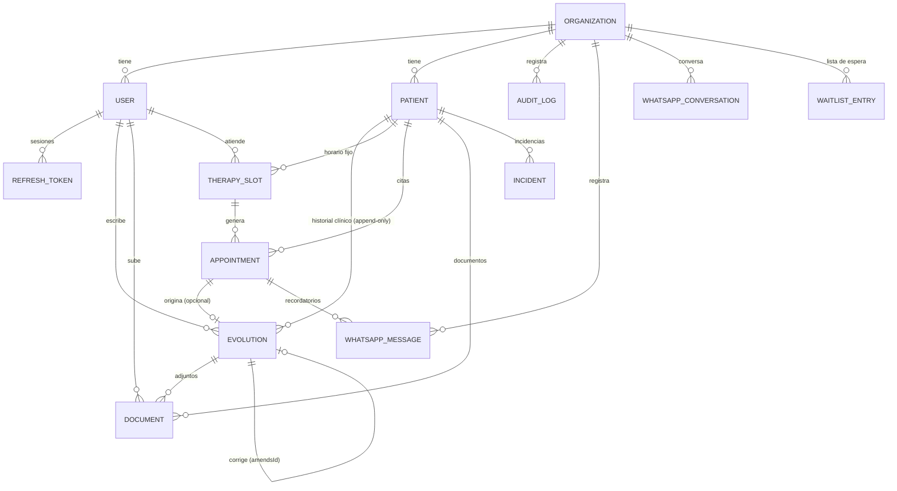

# 02 · Modelo de datos

> Modelo completo del sistema. El **Módulo 1** implementa `organizations`, `users`, `refresh_tokens`, `audit_logs`; el resto de entidades se define aquí para asegurar coherencia y se materializa mediante migraciones incrementales en su módulo correspondiente.

## 1. Convenciones

- **PK:** `id` UUID v4 generado por la aplicación (`@default(uuid())`).
- **Nombres:** modelos en PascalCase (Prisma), tablas/columnas en `snake_case` (`@@map`/`@map`).
- **Timestamps:** `created_at` y `updated_at` en toda tabla mutable (UTC).
- **Multi-tenant (ADR-03):** toda tabla de negocio lleva `organization_id NOT NULL` + índice. Excepción: `refresh_tokens` deriva el tenant de su `user_id` (una sesión pertenece a un usuario, no directamente al tenant).
- **Borrado:** nunca borrado físico de datos clínicos ni de usuarios; se usa `is_active` / estados. `audit_logs` es append-only.
- **Enums:** declarados en Prisma (persistencia) y en `@centro/shared` (contrato API). Ver ADR-09.

## 2. Diagrama entidad-relación (visión completa)

## 3. Módulo 1 — entidades implementadas ahora

### `organizations`
| Columna | Tipo | Notas |
|---|---|---|
| id | uuid PK | |
| name | text | Nombre del centro |
| legal_id | text? | RUT u otro identificador tributario |
| timezone | text | default `America/Santiago`; la agenda depende de esto |
| address / phone / email | text? | Datos de contacto |
| is_active | boolean | default true |
| whatsapp_phone_number_id | text? UNIQUE | Módulo 6: identifica qué organización recibe un webhook entrante de Meta |
| google_forms_url | text? | Módulo 6: enlace de admisión enviado a "Paciente nuevo" en el menú de WhatsApp |
| created_at / updated_at | timestamptz | |

### `users`
| Columna | Tipo | Notas |
|---|---|---|
| id | uuid PK | |
| organization_id | uuid FK → organizations | índice |
| email | text **UNIQUE global** | El login no pide organización ⇒ email único a nivel plataforma (decisión consciente; ver §5.1) |
| password_hash | text | bcrypt (ADR-08); nunca sale de la API |
| first_name / last_name | text | |
| role | enum `UserRole` {ADMIN, PROFESSIONAL} | ADR-04 |
| specialty | enum `Specialty`? | obligatoria si role=PROFESSIONAL, NULL si ADMIN (regla de aplicación) |
| phone | text? | |
| is_active | boolean | soft-delete; un usuario inactivo no puede autenticarse |
| must_change_password | boolean | true al crear/resetear con contraseña temporal |
| created_at / updated_at | timestamptz | |

### `refresh_tokens`
| Columna | Tipo | Notas |
|---|---|---|
| id | uuid PK | |
| user_id | uuid FK → users (CASCADE) | índice |
| token_hash | text UNIQUE | SHA-256 del token opaco; el token en claro nunca se persiste |
| expires_at | timestamptz | now + REFRESH_TOKEN_TTL_DAYS |
| revoked_at | timestamptz? | logout / rotación / revocación masiva |
| replaced_by_id | uuid? | cadena de rotación (forense; detección de reuso, ADR-05) |
| created_by_ip / user_agent | text? | contexto de sesión |
| created_at | timestamptz | |

### `audit_logs` (append-only)
| Columna | Tipo | Notas |
|---|---|---|
| id | uuid PK | |
| organization_id | uuid FK | índice compuesto (organization_id, created_at) |
| user_id | uuid? | NULL en login fallido de email inexistente |
| user_email | text? | snapshot denormalizado (sobrevive a cambios del usuario) |
| action | enum `AuditAction` | CREATE, UPDATE, DELETE, LOGIN, LOGIN_FAILED, LOGOUT, TOKEN_REFRESH, TOKEN_REUSE_DETECTED, PASSWORD_CHANGE, PASSWORD_RESET |
| entity | text | nombre de la tabla/entidad ("User", "Organization", …) |
| entity_id | text? | registro afectado |
| old_value / new_value | jsonb? | **sin** campos sensibles (password_hash se excluye siempre) |
| ip / user_agent | text? | |
| created_at | timestamptz | |

## 4. Módulo 2 — entidades implementadas ahora

> **Módulo 2 — implementado.** Reemplaza el borrador que existía en la sección de "Módulos futuros" (ver §5, donde ya no aparece).

### `patients`
| Columna | Tipo | Notas |
|---|---|---|
| id | uuid PK | |
| organization_id | uuid FK → organizations | índice; toda query filtra explícitamente por este valor (ADR-03) |
| first_name | text | requerido |
| last_name | text | requerido |
| rut | text | formato canónico `XXXXXXXX-Y` (sin puntos, dígito verificador validado con módulo 11 chileno); **único por organización, no global** — ver §6.5 |
| birth_date | date | requerida; no puede ser futura (validación de aplicación) |
| diagnosis | text? | opcional, hasta 500 caracteres |
| phone | text | requerido; WhatsApp del apoderado — canal principal del Módulo 6 |
| email | text? | opcional, formato válido |
| address | text? | opcional |
| observations | text? | opcional, texto libre, hasta 1000 caracteres |
| is_active | boolean | default true; soft-delete, igual que `users`; nunca se borra físicamente |
| drive_folder_id | text? | `NULL` por ahora; lo puebla el Módulo 5 (Documentos) al crear la carpeta en Google Drive. Ningún endpoint del Módulo 2 lo asigna |
| created_at / updated_at | timestamptz | |

**Índices**
- `UNIQUE (organization_id, rut)` — garantiza la unicidad por tenant descrita arriba; permite el mismo RUT en organizaciones distintas.
- `(organization_id)` — filtro obligatorio de todo listado (ADR-03).
- `(organization_id, phone)` — lookup del webhook de WhatsApp (Módulo 6); no es único (en teoría dos organizaciones podrían compartir el número de un mismo apoderado).

La búsqueda por nombre (`search`) se resuelve con `ILIKE` filtrado por `organization_id` sin índice especial a esta escala; se evaluará `pg_trgm`/full-text si el volumen de pacientes por centro lo justifica.

## 5. Módulo 3 — entidades implementadas ahora

> **Módulo 3 — implementado.** Reemplaza el borrador de `therapy_slots`/`appointments` que existía en la sección de "Módulos futuros" (ver §6). Diseño completo, historias de usuario y casos de uso en [modulo-03-agenda.md](./modulos/modulo-03-agenda.md).

### `therapy_slots` (plantilla semanal fija)

| Columna | Tipo | Notas |
|---|---|---|
| id | uuid PK | |
| organization_id | uuid FK → organizations | índice |
| patient_id | uuid FK → patients | índice; el paciente debe estar activo al crear el slot (regla de aplicación) |
| professional_id | uuid FK → users | índice; el usuario debe tener `role=PROFESSIONAL` (regla de aplicación, ver §7.6) |
| weekday | enum `Weekday` {MONDAY…SUNDAY} | día fijo de la semana |
| start_minute | int | minutos desde 00:00 (p. ej. 570 = 09:30); ver §7.6 sobre esta elección frente a un tipo `TIME` |
| duration_minutes | int | 15–240 (validación de aplicación) |
| valid_from | date | inicio de vigencia de la plantilla |
| valid_to | date? | fin de vigencia; `NULL` = indefinida |
| is_active | boolean | default true; desactivar detiene la generación de instancias futuras, **no** afecta instancias ya generadas |
| created_at / updated_at | timestamptz | |

**Índices:** `(organization_id, professional_id)`, `(organization_id, patient_id)`. No hay restricción única de solapamiento a nivel de DB — se valida en `TherapySlotsService` (mismo profesional o mismo paciente, mismo `weekday`, rangos de horario/vigencia que se cruzan ⇒ `409`).

### `appointments` (instancia fechada)

| Columna | Tipo | Notas |
|---|---|---|
| id | uuid PK | |
| organization_id | uuid FK → organizations | índice |
| therapy_slot_id | uuid? FK → therapy_slots | `NULL` = sobrecupo (creada sin plantilla) |
| patient_id | uuid FK → patients | índice compuesto con `date` |
| professional_id | uuid FK → users | índice compuesto con `date` |
| date | date | fecha concreta de la cita |
| start_minute | int | snapshot del horario al momento de generar/crear (no se recalcula si el slot cambia después) |
| duration_minutes | int | snapshot, misma razón |
| status | enum `AppointmentStatus` {PENDIENTE, CONFIRMADA, CANCELADA, NO_ASISTIO, SOBRECUPO, ATENDIDA} | máquina de estados en [modulo-03-agenda.md](./modulos/modulo-03-agenda.md) §1.1; `CANCELADA`/`ATENDIDA`/`NO_ASISTIO` son terminales |
| confirmed_via | enum `ConfirmedVia` {WHATSAPP, MANUAL}? | `NULL` hasta confirmar; este módulo solo produce `MANUAL` (`WHATSAPP` lo poblará el Módulo 6) |
| notes | text? | metadato administrativo mutable (no es historial clínico; no aplica append-only) |
| attendance_marked_by_id | uuid? FK → users | quién marcó asistencia (profesional o admin) |
| attendance_marked_at | timestamptz? | |
| created_at / updated_at | timestamptz | |

**Índices:** `UNIQUE (therapy_slot_id, date)` (Postgres permite múltiples `NULL` en `therapy_slot_id`, por lo que no restringe los sobrecupos) — evita duplicar instancias al repetir la generación; `(organization_id, professional_id, date)`; `(organization_id, patient_id, date)`; `(organization_id, date)`.

## 6. Módulo 4 — entidades implementadas ahora

> **Módulo 4 — implementado.** Reemplaza el borrador de `clinical_records`/`evolutions` que existía en la sección de "Módulos futuros" (ver §7). Diseño completo, decisiones de arquitectura, historias de usuario y casos de uso en [modulo-04-fichas-clinicas.md](./modulos/modulo-04-fichas-clinicas.md).

### `evolutions`

| Columna | Tipo | Notas |
|---|---|---|
| id | uuid PK | |
| organization_id | uuid FK → organizations | índice |
| patient_id | uuid FK → patients | índice compuesto con `date`; **no existe una tabla `clinical_records`** — `Patient` es la identidad de la ficha (decisión de diseño, ver `modulo-04-fichas-clinicas.md` §1.1) |
| author_id | uuid FK → users | siempre un `PROFESSIONAL` (regla de aplicación) |
| appointment_id | uuid? FK → appointments, **UNIQUE** | cita `ATENDIDA` que originó la evolución; vínculo opcional (§1.2 del documento de módulo) |
| amends_id | uuid? FK → evolutions | evolución que esta corrige; append-only real (sin update/delete) |
| date | date | no puede ser futura (validación de aplicación) |
| observation | text | |
| work_plan | text | |
| confidentiality | enum `EvolutionConfidentiality` {STANDARD, PSYCHOLOGICAL} | derivado de `author.specialty` al crear (nunca lo envía el cliente); política de acceso en la capa de aplicación (ADR-04) |
| created_at | timestamptz | **sin `updated_at`**: nunca se modifica una fila existente (mismo criterio que `audit_logs`) |

**Índices:** `UNIQUE (appointment_id)` — a lo sumo una evolución por cita; `(organization_id, patient_id, date)` — listado paginado del historial; `(organization_id, author_id)`.

## 7. Módulo 5 — entidades implementadas ahora

> **Módulo 5 — implementado.** Reemplaza el borrador de `documents` que existía en la sección de "Módulos futuros" (ver §8). Diseño completo, decisiones de arquitectura, historias de usuario y casos de uso en [modulo-05-documentos.md](./modulos/modulo-05-documentos.md).

### `documents`

| Columna | Tipo | Notas |
|---|---|---|
| id | uuid PK | |
| organization_id | uuid FK → organizations | índice |
| patient_id | uuid FK → patients | índice compuesto con `category` |
| evolution_id | uuid? FK → evolutions | **no único** (a diferencia de `evolutions.appointment_id`): una evolución puede tener varios documentos adjuntos |
| uploaded_by_id | uuid FK → users | siempre un `PROFESSIONAL` (regla de aplicación) |
| category | enum `DocumentCategory` {INFORME, EVOLUCION, EXAMEN, RECETA, OTRO} | subcarpeta del árbol del spec |
| name | text | nombre original del archivo |
| mime_type | text | validado contra una lista blanca (PDF/JPEG/PNG/WEBP) en la aplicación |
| size_bytes | int | validado contra `DOCUMENTS_MAX_UPLOAD_BYTES` en la aplicación |
| drive_file_id | text | id opaco devuelto por el adaptador de `DocumentStoragePort` activo — **nunca el binario** (ADR-11) |
| confidentiality | enum `ClinicalConfidentiality` {STANDARD, PSYCHOLOGICAL} | derivado de `uploadedBy.specialty` al subir; mismo enum que `evolutions.confidentiality` (renombrado en este módulo, ver §9.2) |
| created_at | timestamptz | **sin `updated_at`**: append-only, mismo criterio que `evolutions` |

**Índices:** `(organization_id, patient_id, category)`; `(organization_id, evolution_id)`.

**Carpeta del paciente.** `patients.drive_folder_id` (reservado desde el Módulo 2) se asigna de forma perezosa en la primera subida de un documento, no al crear el paciente — ver `modulo-05-documentos.md` §1.2. No existe una tabla de subcarpetas: la subcarpeta de cada `category` se resuelve dentro del adaptador de `DocumentStoragePort` (búsqueda o creación por nombre), nunca se persiste su id.

## 8. Módulo 6 — entidades implementadas ahora

> **Módulo 6 — implementado.** Reemplaza el borrador de `whatsapp_messages`/`whatsapp_conversations` que existía en la sección de "Módulos futuros" (ver §9). Diseño completo, decisiones de arquitectura, historias de usuario y casos de uso en [modulo-06-whatsapp.md](./modulos/modulo-06-whatsapp.md).

### `whatsapp_messages`

| Columna | Tipo | Notas |
|---|---|---|
| id | uuid PK | |
| organization_id | uuid FK → organizations | índice compuesto con `created_at` |
| direction | enum `WhatsAppMessageDirection` {INBOUND, OUTBOUND} | |
| phone | text | del paciente (o del `ADMIN` notificado) |
| template_key | text? | `null` en entrantes (texto libre, nunca interpretado por IA); identifica la plantilla fija en salientes |
| body | text | contenido efectivamente enviado/recibido |
| appointment_id | uuid? FK → appointments | índice compuesto con `template_key` (idempotencia del recordatorio, CU-02) |
| status | enum `WhatsAppMessageStatus` {QUEUED, SENT, DELIVERED, FAILED} | default `QUEUED` |
| provider_message_id | text? | id devuelto por el proveedor de mensajería activo |
| created_at / updated_at | timestamptz | **sí tiene `updated_at`**, a diferencia de `evolutions`/`documents`: el estado de un envío es operativo, no un registro clínico inmutable |

### `whatsapp_conversations`

| Columna | Tipo | Notas |
|---|---|---|
| id | uuid PK | |
| organization_id | uuid FK → organizations | `UNIQUE (organization_id, phone)`: una conversación activa por teléfono y organización |
| phone | text | |
| current_step | enum `WhatsAppConversationStep` {IDLE, AWAITING_MENU_CHOICE, AWAITING_ATTENDANCE_CONFIRMATION} | default `IDLE` |
| context | jsonb? | p. ej. `{ "appointmentId": "..." }` en `AWAITING_ATTENDANCE_CONFIRMATION` |
| expires_at | timestamptz | vencida ⇒ se trata como `IDLE` (no se interpreta una respuesta vieja fuera de contexto) |
| created_at / updated_at | timestamptz | |

## 9. Módulos futuros — diseño de referencia

Resumen de columnas clave (el detalle fino se cierra al iniciar cada módulo):

- **`waitlist_entries`** (M7): datos del formulario de Google Forms + status {PENDIENTE, CONTACTADO, ADMITIDO, DESCARTADO}, requested_specialty, notes; al admitir se crea el Patient.
- **`incidents`** (M8): patient_id?, reported_by, type {VIOLENCIA, ABUSO, ACCIDENTE, OTRO_GRAVE}, severity, description, occurred_at, status {ABIERTA, EN_SEGUIMIENTO, CERRADA}. Prioridad alta ⇒ notificación inmediata al administrador.

## 10. Decisiones de modelado

### 10.1 Email único global (no por organización)
El login es `email + password` sin selector de centro. Si un día se necesita que una misma persona exista en dos centros, se introducirá una tabla `memberships` (user ↔ organization N–M) — cambio aditivo que no rompe el contrato actual.

### 10.2 La ficha clínica nunca se sobreescribe, y no es una tabla propia
`evolutions` es estrictamente append-only (sin UPDATE/DELETE en repositorio ni endpoint); `documents` sigue el mismo criterio (Módulo 5). Las correcciones de una evolución se modelan como nueva evolución con referencia `amends_id`. La "ficha clínica" no tiene una tabla `clinical_records` dedicada: `Patient` ya es su identidad natural (una fila por paciente, por construcción) y `Evolution.patientId`/`Document.patientId` la referencian directamente — ver la justificación completa en [modulo-04-fichas-clinicas.md](./modulos/modulo-04-fichas-clinicas.md) §1.1. El enum de confidencialidad se llamaba `EvolutionConfidentiality`; el Módulo 5 lo renombró a `ClinicalConfidentiality` al pasar a ser compartido por `Evolution` y `Document` (evita duplicar un enum idéntico, ver `modulo-05-documentos.md`).

### 10.3 Agenda = plantilla + instancias (implementado, Módulo 3)
La regla "día/hora/profesional fijos, sin reservas dinámicas" se modela con `therapy_slots` (plantilla semanal administrada solo por ADMIN) y `appointments` (instancias por fecha, generadas on-demand vía `POST /therapy-slots/generate-appointments`; un job semanal automático es una evolución aditiva sobre el mismo caso de uso). Los estados del spec viven en la instancia, con una máquina de estados explícita (terminales: `CANCELADA`, `ATENDIDA`, `NO_ASISTIO`) documentada en [modulo-03-agenda.md](./modulos/modulo-03-agenda.md) §1.1. El flujo WhatsApp (implementado, Módulo 6) muta `status` de la instancia con `confirmed_via=WHATSAPP` — nunca la plantilla — vía `AppointmentsService.applyWhatsAppResponse`, sin reabrir el contrato HTTP de `PATCH /appointments/:id/status` (ver [modulo-06-whatsapp.md](./modulos/modulo-06-whatsapp.md) §1). El vínculo entre una atención y su evolución (`evolutions.appointment_id`) es opcional y tampoco reabre el contrato de `PATCH /appointments/:id/attendance` — ver [modulo-04-fichas-clinicas.md](./modulos/modulo-04-fichas-clinicas.md) §1.2.

### 10.4 Confidencialidad psicológica a nivel de fila (implementado, Módulos 4–5)
`ClinicalConfidentiality` (`STANDARD` | `PSYCHOLOGICAL`) se deriva de `specialty` del autor/subidor al crear, nunca del request, tanto en `Evolution` como en `Document`. El filtro se aplica en la capa de aplicación (`EvolutionsService`/`DocumentsService`), no en el repositorio: toda lectura pasa por un mapeo a DTO que redacta el contenido (`observation`/`workPlan`/`amendsId` en evoluciones; `name`/`mimeType`/`sizeBytes` y la descarga misma en documentos) para cualquier actor sin `specialty=PSICOLOGIA` — **incluido `ADMIN`** (ADR-04) — devolviendo solo metadatos (fecha, autor, existencia). La auditoría de un registro `PSYCHOLOGICAL` tampoco incluye ese contenido en `new_value`: la auditoría no es una puerta trasera a lo que la API no expone.

### 10.5 RUT único por organización, no global
`patients.rut` se valida y desduplica **dentro de cada organización**, no a nivel de plataforma. Dos organizaciones son tenants independientes (ADR-03): un mismo RUT puede existir en ambas sin que constituya un conflicto de negocio, y verificar unicidad cruzando organizaciones exigiría consultas que atraviesan el límite de tenant, lo que el diseño de repositorio evita deliberadamente. Si en el futuro se necesitara identificar a la misma persona en dos centros (por ejemplo, para reportes consolidados de una cadena), se resolvería con una entidad de nivel superior (análoga a la `memberships` de §10.1), no relajando el aislamiento por organización.

### 10.6 `start_minute` (int) en vez de un tipo `TIME`
`therapy_slots.start_minute` y `appointments.start_minute` guardan minutos desde medianoche (p. ej. `570` = 09:30) en vez de `@db.Time`. Evita la ambigüedad de zona horaria y de serialización de un tipo `Time` de Prisma (que en JS se representa como `Date` con una fecha base arbitraria), y simplifica la aritmética de solapamiento (`start`, `start + duration`) a comparaciones de enteros. El contrato REST (`@centro/shared`) igualmente expone `"HH:MM"` como string — la conversión vive en la capa de aplicación del módulo Agenda, nunca en `domain` ni en `presentation`.
