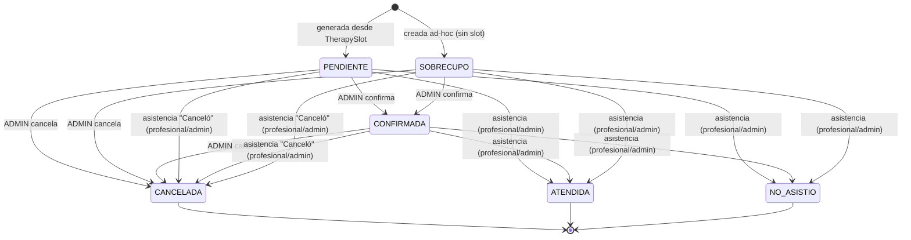

# Módulo 3 · Agenda

> Documento de módulo según la metodología del proyecto. Coherente con [01-arquitectura.md](../01-arquitectura.md) (ADR-03, ADR-04, ADR-07, ADR-09, ADR-10) y [02-modelo-datos.md](../02-modelo-datos.md) §5 (`therapy_slots`, `appointments`). Plantilla y nivel de detalle según [modulo-01-autenticacion.md](./modulo-01-autenticacion.md) y [modulo-02-pacientes.md](./modulo-02-pacientes.md).
>
> **Alcance:** administración de la plantilla semanal fija (`TherapySlot`), generación y gestión de instancias fechadas (`Appointment`) con su máquina de estados, y el acceso de lectura del `PROFESSIONAL` a `/patients` diferido en el Módulo 2 (§1.1 de ese documento). **Fuera de alcance:** confirmación automática vía WhatsApp (Módulo 6 — aquí solo existe `confirmedVia=MANUAL`), evoluciones clínicas (Módulo 4), documentos (Módulo 5), lista de espera (Módulo 7).

## 1. Reglas de negocio del módulo (resumen normativo)

- La agenda se modela como **plantilla → instancias** (decisión ya registrada en `02-modelo-datos.md` §6.3): `TherapySlot` es el día/hora/profesional fijo de un paciente; `Appointment` es la cita concreta de una fecha, con estado.
- **Solo `ADMIN`** crea, edita y desactiva `TherapySlot`. El `PROFESSIONAL` nunca modifica la agenda (spec: *"el administrador administra completamente la agenda; los profesionales NO pueden modificarla"*), solo la consulta (§1.2).
- Un `TherapySlot` no se borra físicamente: se desactiva (`isActive=false`). Desactivar un slot no afecta `Appointment` ya generados; solo detiene la generación de instancias futuras.
- **Validación de solapamiento** (aplicación, no restricción de DB): al crear/editar un slot activo, no puede solaparse en el mismo día de la semana con otro slot activo del **mismo profesional** ni con otro slot activo del **mismo paciente**, considerando el rango de vigencia (`validFrom`/`validTo`). Un profesional puede atender a varios pacientes en horarios distintos; un paciente puede tener varios slots (distintas especialidades) siempre que no se crucen en el tiempo.
- Las instancias (`Appointment`) se generan a partir de los slots activos para un rango de fechas mediante una acción explícita (`POST /therapy-slots/generate-appointments`, solo `ADMIN`). La generación es **idempotente**: nunca duplica una instancia ya existente para el mismo slot y fecha. El Módulo 6 (WhatsApp) o un futuro job programado podrán invocar el mismo caso de uso sin cambiar el contrato.
- **Sobrecupo**: una cita puede crearse sin plantilla (`therapySlotId=null`, solo `ADMIN`, `POST /appointments`) para atenciones excepcionales fuera del horario fijo del paciente.
- **Estados de `Appointment`** (spec, textual): Pendiente, Confirmada, Cancelada, No asistió, Sobrecupo, Atendida. Ver §1.1 la máquina de estados exacta.
- El `PROFESSIONAL` puede **marcar asistencia** (`Asistió` / `No asistió` / `Canceló`) únicamente sobre **sus propias** citas (`professionalId` = actor) y únicamente para fecha **hoy o pasada** — no puede marcar asistencia de una cita futura. `ADMIN` puede marcar asistencia sin esa restricción de fecha (gestión administrativa/backfill).
- El resto de cambios de estado (confirmar, cancelar) los realiza **solo `ADMIN`** en este módulo — la confirmación automática por WhatsApp (`confirmedVia=WHATSAPP`) queda reservada al Módulo 6; aquí toda confirmación registrada por el sistema es `confirmedVia=MANUAL`.
- `notes` de `Appointment` es metadato administrativo mutable (motivo de cancelación, observación de agenda) — **no** es historial clínico y no aplica la regla de append-only de las evoluciones (Módulo 4); se sobreescribe libremente.
- Toda mutación de `TherapySlot` y `Appointment` (`CREATE`/`UPDATE`/cambio de estado/desactivación) se audita en `audit_logs` (ADR-10), igual que en los módulos 1 y 2.
- **Cierra la decisión diferida del Módulo 2 (§1.1):** `GET /patients` y `GET /patients/:id` dejan de responder `403` a `PROFESSIONAL`; responden datos filtrados por los pacientes que tienen al menos un `TherapySlot` activo con ese profesional (§1.2).

### 1.1 Máquina de estados de `Appointment`

**Decisión de diseño.** `CANCELADA`, `ATENDIDA` y `NO_ASISTIO` son **terminales**: ninguna transición sale de ellos. Reagendar significa cancelar la cita actual y crear una nueva (regular, en su próxima instancia generada, o sobrecupo) — nunca reabrir un estado. Es el mismo criterio que en evoluciones clínicas (nunca sobrescribir, siempre un registro nuevo) aplicado a la agenda: preserva la trazabilidad de qué pasó realmente con cada instancia, requisito implícito para los reportes del Módulo 9 (inasistencias, cancelaciones).

El **origen** de la cita (`therapySlotId` nulo o no) determina el estado inicial; **no** determina los estados posteriores — una vez confirmada o atendida, una cita de sobrecupo es indistinguible en su ciclo de vida de una regular (la trazabilidad del origen queda en `therapySlotId`, no en el estado).

### 1.2 Decisión de diseño: acceso de `PROFESSIONAL` a `/patients` (cierra Módulo 2 §1.1)

**Contexto.** El Módulo 2 dejó `PROFESSIONAL` con `403` en todo `/patients` porque la asignación paciente–profesional no existía aún en el modelo. Ese modelo ya existe: `TherapySlot.patientId` + `TherapySlot.professionalId`.

**Decisión.** `GET /patients` y `GET /patients/:id` aceptan `PROFESSIONAL` y devuelven **solo** los pacientes con al menos un `TherapySlot` **activo** (`isActive=true`) donde `professionalId` = el actor autenticado. Un paciente sin slot activo con ese profesional se comporta como **inexistente** (`404` en `GET /:id`, ausente en el listado) — mismo criterio que el aislamiento de tenant: no se revela existencia fuera del alcance del actor. `POST`/`PATCH`/`DELETE /patients` **siguen siendo exclusivos de `ADMIN`** (el profesional no administra pacientes, solo los consulta — spec: *"ver pacientes asignados"*).

**Justificación.** La regla deriva de un dato ya modelado (el slot), no de una tabla de "asignaciones" nueva — evita duplicar la fuente de verdad. Usar `isActive` (no vigencia por fecha `validFrom`/`validTo`) mantiene la regla simple y consistente con el resto del sistema (mismo criterio que `User.isActive`/`Patient.isActive`); si en el futuro se requiere una noción de "vigente a la fecha", es un cambio aditivo en el filtro, no un cambio de contrato.

**Implementación (resumen, ver §3.6).** `AgendaModule` expone `AgendaAccessService.getAssignedPatientIds(organizationId, professionalId)`. `PatientsModule` importa `AgendaModule` y `PatientsService` lo invoca cuando el actor es `PROFESSIONAL`, aplicando el resultado como filtro (`patientIds`) en el repositorio. La dependencia es unidireccional (`patients` → `agenda`); `agenda` no conoce `patients` como módulo Nest (solo lee la tabla `patients` vía Prisma en su propia capa de infraestructura), por lo que no hay ciclo de módulos.

## 2. Historias de usuario

### 2.1 Como administrador

#### HU-01 · Crear plantilla de horario fijo
> Como administrador quiero fijar el día, hora y profesional de un paciente para que asista siempre al mismo horario.

- **Dado** un paciente y un profesional de su organización, **cuando** crea un `TherapySlot` con día, hora y duración válidos, **entonces** recibe `201` con el slot creado (`isActive=true`) y se audita `CREATE`.
- **Dado** un slot activo del mismo profesional que se solapa en el mismo día de la semana, **cuando** intenta crear el nuevo slot, **entonces** recibe `409`.
- **Dado** un slot activo del mismo paciente que se solapa en el mismo día de la semana (con otro profesional u otra especialidad), **cuando** intenta crear el nuevo slot, **entonces** recibe `409`.
- **Dado** un paciente o profesional inexistente en su organización, **cuando** intenta crear el slot, **entonces** recibe `404`.
- **Dado** un profesional con rol `ADMIN` (sin especialidad asignada) como `professionalId`, **cuando** intenta crear el slot, **entonces** recibe `400` (solo usuarios `PROFESSIONAL` pueden tener slots).

#### HU-02 · Editar o desactivar una plantilla
> Como administrador quiero corregir el horario fijo de un paciente o darlo de baja cuando cambia o egresa.

- **Dado** un slot existente de su organización, **cuando** lo edita (día, hora, duración, vigencia), **entonces** el sistema revalida solapamientos con el nuevo horario y responde `200` (o `409` si colisiona).
- **Dado** un slot activo, **cuando** lo desactiva, **entonces** responde `204`, el slot queda `isActive=false`, no se generan más instancias desde él, y las instancias ya generadas **no se modifican**.

#### HU-03 · Generar instancias de agenda
> Como administrador quiero generar las citas concretas de un período a partir de los horarios fijos, para no crearlas una por una.

- **Dado** slots activos vigentes en un rango de fechas, **cuando** ejecuta `POST /therapy-slots/generate-appointments` con `from`/`to`, **entonces** se crea un `Appointment` en estado `PENDIENTE` por cada combinación (slot, fecha) que coincide con el día de la semana del slot dentro de su vigencia y que **no existía previamente**.
- **Dado** un rango ya generado, **cuando** repite la generación para el mismo rango, **entonces** no se crean duplicados (idempotente) y responde con el conteo de instancias nuevas creadas (puede ser `0`).
- **Dado** un rango mayor a 60 días, **cuando** intenta generar, **entonces** recibe `400` (límite de tamaño de lote).

#### HU-04 · Registrar un sobrecupo
> Como administrador quiero agendar una atención puntual fuera del horario fijo de un paciente.

- **Dado** un paciente y profesional válidos de su organización y un horario sin conflicto, **cuando** crea un `Appointment` sin `therapySlotId`, **entonces** recibe `201` en estado `SOBRECUPO` y se audita `CREATE`.
- **Dado** un horario que se solapa con otra cita no cancelada del mismo profesional o del mismo paciente, **cuando** intenta crear el sobrecupo, **entonces** recibe `409`.

#### HU-05 · Confirmar o cancelar una cita
> Como administrador quiero confirmar o cancelar citas para mantener la agenda al día.

- **Dado** una cita en estado `PENDIENTE` o `SOBRECUPO`, **cuando** la confirma (`PATCH /appointments/:id/status` con `status=CONFIRMADA`), **entonces** responde `200`, `confirmedVia=MANUAL` y se audita `UPDATE`.
- **Dado** una cita en estado `PENDIENTE`, `SOBRECUPO` o `CONFIRMADA`, **cuando** la cancela, **entonces** responde `200` con `status=CANCELADA` (terminal).
- **Dado** una cita ya en estado terminal (`CANCELADA`, `ATENDIDA`, `NO_ASISTIO`), **cuando** intenta cualquier cambio de estado, **entonces** recibe `409`.

#### HU-06 · Ver y filtrar la agenda completa
- **Dado** citas de su organización, **cuando** consulta `GET /appointments` con filtros (`dateFrom`, `dateTo`, `professionalId`, `patientId`, `status`, `page`, `pageSize`), **entonces** recibe `200` con `Paginated<AppointmentDto>`.

### 2.2 Como profesional

#### HU-07 · Ver mi agenda
> Como profesional quiero ver mis propias citas para saber a quién debo atender.

- **Dado** un profesional autenticado, **cuando** consulta `GET /appointments` (con los mismos filtros de fecha/estado), **entonces** recibe solo las citas donde `professionalId` = su propio id, sin importar el valor de `professionalId` que envíe en el query.
- **Dado** un profesional autenticado, **cuando** consulta `GET /therapy-slots`, **entonces** recibe solo sus propios slots (lectura, sin acciones de edición disponibles).

#### HU-08 · Marcar asistencia
> Como profesional quiero marcar si el paciente asistió, no asistió o canceló, para mantener las estadísticas al día.

- **Dado** una cita propia (`professionalId` = actor) de fecha hoy o pasada en estado no terminal, **cuando** marca `PATCH /appointments/:id/attendance` con `Asistió` (`ATENDIDA`), `No asistió` (`NO_ASISTIO`) o `Canceló` (`CANCELADA`), **entonces** responde `200` y se audita `UPDATE`.
- **Dado** una cita de otro profesional, **cuando** intenta marcar asistencia, **entonces** recibe `404` (no pertenece a su alcance, mismo criterio que el aislamiento de tenant).
- **Dado** una cita propia de fecha **futura**, **cuando** intenta marcar asistencia, **entonces** recibe `400`.
- **Dado** una cita propia ya en estado terminal, **cuando** intenta marcar asistencia de nuevo, **entonces** recibe `409`.

#### HU-09 · Ver pacientes asignados
> Como profesional quiero ver la ficha básica de mis pacientes asignados.

- **Dado** un profesional autenticado, **cuando** consulta `GET /patients`, **entonces** recibe solo los pacientes con un `TherapySlot` activo asignado a él (§1.2), paginados y filtrables igual que para `ADMIN`.
- **Dado** un paciente sin slot activo asignado a él, **cuando** consulta `GET /patients/:id` con ese id, **entonces** recibe `404`.
- **Dado** un profesional en el frontend, **cuando** navega el dashboard, **entonces** el sidebar muestra "Pacientes" (antes oculto en el Módulo 2) en modo solo lectura, sin acciones de crear/editar/desactivar.

## 3. Casos de uso

### CU-01 · Crear `TherapySlot`

| | |
|---|---|
| **Actor** | ADMIN |
| **Endpoint** | `POST /api/v1/therapy-slots` |

**Flujo principal**
1. Valida el DTO: `patientId`, `professionalId`, `weekday`, `startTime` (`HH:MM`), `durationMinutes` (15–240), `validFrom`, `validTo?`.
2. Verifica que `patientId` exista y esté activo en la organización del actor; que `professionalId` corresponda a un usuario `PROFESSIONAL` activo de la misma organización.
3. Verifica solapamiento contra slots activos del mismo profesional y del mismo paciente en el mismo `weekday` (rango horario y vigencia).
4. Crea el slot (`isActive=true`) y audita `CREATE` sobre `TherapySlot`.
5. Responde `201` con `TherapySlotDto`.

**Excepciones:** `404` paciente/profesional inexistente · `400` profesional sin rol `PROFESSIONAL`, horario/duración inválidos, `validTo` anterior a `validFrom` · `409` solapamiento.

### CU-02 · Editar / desactivar `TherapySlot`

| | |
|---|---|
| **Actor** | ADMIN |
| **Endpoint** | `PATCH /api/v1/therapy-slots/:id` (edición) · `DELETE /api/v1/therapy-slots/:id` (desactivación) |

**Flujo principal (PATCH)**
1. Carga el slot por `id` + `organizationId`.
2. Revalida solapamiento con el estado resultante (si cambia `weekday`, horario, duración o vigencia).
3. Persiste, audita `UPDATE`, responde `200`.

**Flujo principal (DELETE)**
1. Carga el slot; marca `isActive=false`; audita `DELETE`; responde `204`. No toca `Appointment` existentes. Idempotente sobre un slot ya inactivo.

**Excepciones:** `404` inexistente en la organización · `409` solapamiento (PATCH).

### CU-03 · Generar instancias (`Appointment` desde `TherapySlot`)

| | |
|---|---|
| **Actor** | ADMIN |
| **Endpoint** | `POST /api/v1/therapy-slots/generate-appointments` |

**Flujo principal**
1. Valida `{ from, to }` (fechas ISO, `to >= from`, rango ≤ 60 días).
2. Para cada `TherapySlot` activo de la organización cuyo `weekday` cae en el rango y cuya vigencia (`validFrom`/`validTo`) intersecta el rango solicitado, calcula las fechas concretas.
3. Por cada (slot, fecha), si no existe ya un `Appointment` para ese par, lo crea en `PENDIENTE` con `patientId`/`professionalId`/`startTime`/`durationMinutes` copiados del slot al momento de generar (snapshot).
4. Responde `200` con `{ created: number, skipped: number }`.

**Excepciones:** `400` rango inválido o mayor a 60 días.

**Nota de diseño.** El snapshot de horario en el `Appointment` (en vez de resolverlo por join en cada lectura) hace que una edición posterior del slot **no altere retroactivamente** instancias ya generadas — coherente con el principio de no reescribir historial ya aplicado a `evolutions` (Módulo 4) y a `patients` (nunca borrado físico).

### CU-04 · Crear sobrecupo

| | |
|---|---|
| **Actor** | ADMIN |
| **Endpoint** | `POST /api/v1/appointments` |

**Flujo principal**
1. Valida `patientId`, `professionalId`, `date`, `startTime`, `durationMinutes`, `notes?`.
2. Verifica paciente y profesional de la organización (mismas reglas que CU-01).
3. Verifica que no exista otra cita no cancelada del mismo profesional o del mismo paciente que se solape en fecha/horario.
4. Crea el `Appointment` con `therapySlotId=null`, `status=SOBRECUPO`; audita `CREATE`.
5. Responde `201`.

**Excepciones:** `404` paciente/profesional inexistente · `400` validación · `409` solapamiento de horario.

### CU-05 · Cambiar estado administrativo de una cita

| | |
|---|---|
| **Actor** | ADMIN |
| **Endpoint** | `PATCH /api/v1/appointments/:id/status` |

**Flujo principal**
1. Carga la cita por `id` + `organizationId`.
2. Valida la transición contra la máquina de estados (§1.1); `CONFIRMADA` fija `confirmedVia=MANUAL`.
3. Persiste, audita `UPDATE` (valor anterior/nuevo), responde `200`.

**Excepciones:** `404` inexistente en la organización · `409` transición inválida (p. ej. la cita ya está en un estado terminal, o se pide un estado no alcanzable por esta vía — `ATENDIDA`/`NO_ASISTIO` se gestionan por CU-06).

### CU-06 · Marcar asistencia

| | |
|---|---|
| **Actor** | PROFESSIONAL (propia) o ADMIN (cualquiera) |
| **Endpoint** | `PATCH /api/v1/appointments/:id/attendance` |

**Flujo principal**
1. Carga la cita por `id` + `organizationId`; si el actor es `PROFESSIONAL`, exige `professionalId` = actor (en caso contrario, `404`).
2. Si el actor es `PROFESSIONAL`, exige `date <= hoy` (zona horaria de la organización).
3. Valida la transición (§1.1): `ATENDIDA`, `NO_ASISTIO` o `CANCELADA` desde un estado no terminal.
4. Persiste, registra `attendanceMarkedById`/`attendanceMarkedAt`, audita `UPDATE`, responde `200`.

**Excepciones:** `404` inexistente en la organización o de otro profesional (actor `PROFESSIONAL`) · `400` fecha futura (actor `PROFESSIONAL`) · `409` estado terminal previo.

### CU-07 · Listar y ver agenda

| | |
|---|---|
| **Actor** | ADMIN (todas) / PROFESSIONAL (propias) |
| **Endpoint** | `GET /api/v1/appointments` · `GET /api/v1/therapy-slots` |

**Flujo principal**
1. Filtra siempre por `organizationId` del token.
2. Si el actor es `PROFESSIONAL`, fuerza `professionalId` = actor, ignorando cualquier `professionalId` de query.
3. Aplica el resto de filtros (`dateFrom`/`dateTo`/`patientId`/`status`/`page`/`pageSize`) y pagina.

Sin efectos secundarios (no se audita lectura).

### CU-08 · Listar/ver pacientes como `PROFESSIONAL` (cierra Módulo 2 §1.1)

| | |
|---|---|
| **Actor** | PROFESSIONAL |
| **Endpoint** | `GET /api/v1/patients` · `GET /api/v1/patients/:id` |

**Flujo principal**
1. `PatientsService` obtiene de `AgendaModule` el conjunto de `patientId` con `TherapySlot` activo asignado al actor.
2. Aplica ese conjunto como filtro adicional (`AND id IN (...)`) sobre la consulta habitual de `ADMIN`.
3. `GET /:id` fuera del conjunto ⇒ `404`.

## 4. Reglas de validación (formularios / DTOs)

### 4.1 `CreateTherapySlotRequest`

| Campo | Regla |
|---|---|
| `patientId` | UUID, requerido |
| `professionalId` | UUID, requerido |
| `weekday` | enum `Weekday` (`MONDAY`…`SUNDAY`), requerido |
| `startTime` | `HH:MM` 24h, requerido (validador `IsTimeString`) |
| `durationMinutes` | entero 15–240, requerido |
| `validFrom` | fecha ISO (`YYYY-MM-DD`), requerido |
| `validTo` | fecha ISO opcional; si presente, `>= validFrom` |

### 4.2 `UpdateTherapySlotRequest`

Igual a 4.1, todos los campos opcionales, más `isActive?: boolean` (reactivar/desactivar sin pasar por `DELETE`).

### 4.3 `CreateAppointmentRequest` (sobrecupo)

| Campo | Regla |
|---|---|
| `patientId`, `professionalId` | UUID, requeridos |
| `date` | fecha ISO, requerida |
| `startTime` | `HH:MM`, requerido |
| `durationMinutes` | entero 15–240, requerido |
| `notes` | opcional, máx. 500 caracteres |

### 4.4 `UpdateAppointmentStatusRequest`

`status`: `IsIn(['CONFIRMADA', 'CANCELADA'])` · `notes?` opcional máx. 500.

### 4.5 `MarkAttendanceRequest`

`status`: `IsIn(['ATENDIDA', 'NO_ASISTIO', 'CANCELADA'])` · `notes?` opcional máx. 500.

### 4.6 `GenerateAppointmentsRequest`

`from`, `to`: fechas ISO; `to >= from`; `(to - from) <= 60 días`.

### 4.7 `AppointmentsQuery` / `TherapySlotsQuery`

`dateFrom?`, `dateTo?` (ISO), `professionalId?` (UUID; ignorado si el actor es `PROFESSIONAL`), `patientId?` (UUID), `status?` (`AppointmentStatus`, solo `AppointmentsQuery`), `page`, `pageSize` (`PageQuery`).

## 5. Componentes UI (apps/web)

### 5.1 Página de agenda (`/dashboard/agenda`)

- **ADMIN:** dos pestañas — "Plantillas" (tabla de `TherapySlot`: paciente, profesional, día, hora, duración, vigencia, estado; acciones crear/editar/desactivar) y "Citas" (tabla de `Appointment` con filtros de fecha/profesional/paciente/estado; acciones confirmar, cancelar, crear sobrecupo, botón "Generar citas" con selector de rango).
- **PROFESSIONAL:** una sola vista, "Mi agenda" — tabla de sus propias citas (filtrable por fecha), con acción "Marcar asistencia" (Asistió / No asistió / Canceló) habilitada solo para fecha ≤ hoy y estado no terminal.
- Estados de carga/vacío/error consistentes con el patrón de Pacientes/Usuarios (skeleton, mensaje + CTA, alert con reintento).

### 5.2 Diálogos

- Crear/editar `TherapySlot` (ADMIN): selector de paciente, profesional (filtrado a `role=PROFESSIONAL` activos), día de la semana, hora, duración, vigencia.
- Crear sobrecupo (ADMIN): paciente, profesional, fecha, hora, duración, notas.
- Confirmar / cancelar cita (ADMIN): confirmación simple con motivo opcional en cancelación.
- Marcar asistencia (PROFESSIONAL/ADMIN): tres acciones (Asistió / No asistió / Canceló) con confirmación.

### 5.3 Página de pacientes — ajuste para `PROFESSIONAL`

- El sidebar deja de ocultar "Pacientes" para `PROFESSIONAL` (ajuste al Módulo 2 §5.1); la página se renderiza sin los botones de crear/editar/desactivar cuando el rol es `PROFESSIONAL` (misma tabla, modo solo lectura).

## 6. Plan de pruebas

### 6.1 Unitarias (apps/api, sin DB — dobles en memoria)

**TherapySlotsService**
- Crear slot válido ⇒ `201`/objeto creado, `isActive=true`.
- Solapamiento con slot activo del mismo profesional en el mismo `weekday` ⇒ `ConflictException`; sin solapamiento en `weekday` distinto ⇒ permitido.
- Solapamiento con slot activo del mismo paciente (otro profesional) ⇒ `ConflictException`.
- `professionalId` de un usuario `ADMIN` (no `PROFESSIONAL`) ⇒ `BadRequestException`.
- Desactivar slot no afecta `Appointment` ya creados; idempotente.
- Todo método de repositorio recibe `organizationId` explícito; `id` de otra organización ⇒ `404`.

**AppointmentsService**
- Generación: no duplica instancias para el mismo (slot, fecha) al repetir el rango; respeta vigencia (`validFrom`/`validTo`) y `weekday`.
- Sobrecupo: se crea con `therapySlotId=null`, `status=SOBRECUPO`; solapamiento con otra cita no cancelada del mismo profesional/paciente ⇒ `409`.
- Máquina de estados (§1.1): todas las transiciones válidas permitidas; cualquier transición desde un estado terminal ⇒ `ConflictException`; `CONFIRMADA` fija `confirmedVia=MANUAL`.
- `attendance`: profesional puede marcar su propia cita de fecha pasada/hoy; cita de otro profesional ⇒ `NotFoundException`; cita futura ⇒ `BadRequestException`; `ADMIN` sin restricción de fecha.
- Listados: `PROFESSIONAL` siempre ve solo `professionalId=self` aunque envíe otro id por query.
- Toda mutación genera un registro `AuditService` con el `entity` correcto (`TherapySlot`/`Appointment`).

**AgendaAccessService (usado por PatientsService)**
- `getAssignedPatientIds` devuelve solo pacientes con slot **activo** del profesional dado; un slot desactivado no cuenta.

**PatientsService (ajuste del Módulo 2)**
- `PROFESSIONAL` en `findMany`/`findOne`: solo ve pacientes con slot activo asignado; paciente fuera de alcance ⇒ `404` en `findOne`, ausente en `findMany`.
- `ADMIN` no se ve afectado (sin cambio de comportamiento respecto al Módulo 2).

**Guards**
- `RolesGuard` sobre `/therapy-slots` (todas las mutaciones): `PROFESSIONAL` ⇒ `403`; lectura permitida a ambos roles.
- `/appointments`: creación de sobrecupo y `/status` exclusivos de `ADMIN` (`403` a `PROFESSIONAL`); `/attendance` permitido a ambos con el alcance de CU-06.

### 6.2 E2E (apps/api + PostgreSQL de prueba)

1. **Ciclo completo ADMIN:** crear paciente y profesional (fixtures) → crear `TherapySlot` → generar citas → aparecen `PENDIENTE` en `GET /appointments` → confirmar → marcar asistencia (`ATENDIDA`) → verificar estado final y auditoría.
2. **RBAC:** `PROFESSIONAL` recibe `403` en `POST/PATCH/DELETE /therapy-slots`, `POST /appointments` y `PATCH /appointments/:id/status`.
3. **Alcance del profesional:** `PROFESSIONAL` con citas propias y ajenas en la misma organización — `GET /appointments` solo devuelve las propias; `PATCH /:id/attendance` sobre una cita ajena ⇒ `404`.
4. **Multi-tenant:** slots/citas de la organización A no son visibles ni editables desde una sesión de la organización B (`404`).
5. **Acceso a pacientes (cierra M2 §1.1):** `PROFESSIONAL` con un paciente asignado ve solo ese paciente en `GET /patients`; `GET /patients/:id` de un paciente no asignado ⇒ `404`; `POST/PATCH/DELETE /patients` con sesión `PROFESSIONAL` ⇒ `403` (sin cambios respecto al Módulo 2).
6. **Idempotencia de generación:** ejecutar `generate-appointments` dos veces sobre el mismo rango no duplica filas (verificado por conteo en DB).
7. **Auditoría:** creación de slot, generación, confirmación, cancelación y marca de asistencia dejan registro en `audit_logs` con `entity` correcto.

### 6.3 Frontend (mínimo del módulo)

- Unitarias de los schemas zod (slot, sobrecupo, cambio de estado, asistencia), en paridad con §4.
- El sidebar muestra "Agenda" a ambos roles y "Pacientes" también a `PROFESSIONAL` (ya no oculto); la página de pacientes no muestra acciones de mutación para `PROFESSIONAL`.

## 7. Definición de Hecho (DoD)

El módulo 3 se considera **terminado** cuando:

- [x] Superficie REST completa (`therapy-slots`, `appointments`, `therapy-slots/generate-appointments`) implementada y documentada en Swagger, incluyendo códigos de error.
- [x] Migración Prisma aplicada para `therapy_slots` y `appointments` (enums `Weekday`, `AppointmentStatus`, `ConfirmedVia`), con los índices descritos en `02-modelo-datos.md`.
- [x] Todas las reglas de negocio de §1 (incluida la máquina de estados §1.1) cubiertas por tests unitarios o e2e; suites en verde.
- [x] `RolesGuard` aplicado según la matriz de §6.1; `PROFESSIONAL` sin acceso de escritura a la agenda en ningún endpoint.
- [x] Auditoría verificada para `TherapySlot` y `Appointment` en toda mutación.
- [x] **Decisión §1.2 implementada y probada**: `PROFESSIONAL` accede a `/patients` (lectura) filtrado por slots asignados; el Módulo 2 §1.1 queda formalmente cerrado (sin `403` general remanente).
- [x] Frontend operativo: gestión de plantillas y citas para `ADMIN`, vista de agenda propia y marcado de asistencia para `PROFESSIONAL`, página de pacientes accesible (solo lectura) para `PROFESSIONAL`.
- [x] Aislamiento multi-tenant y de alcance por profesional verificado en e2e.
- [x] `tsc --noEmit`, ESLint y Prettier sin errores en `apps/api`, `apps/web` y `packages/shared`.
- [x] Documentación actualizada: este archivo, `02-modelo-datos.md` y `04-api-rest.md` (ya reflejaban el diseño final del módulo) y `01-arquitectura.md` (tabla de estado del módulo, actualizada a "Completo").

Cumplido el DoD, se habilita el inicio del **Módulo 4 · Fichas clínicas**.
